[](/LICENSE)  

This project is an entity diagram editor, developed with Next.js, an open-source React web application framework that enables server-side rendering and client-side rendering for web applications. This editor allows users to create, visualize, and edit entity diagrams easily and efficiently.

## Features

- **Entity Diagram Creation:** Users can create entity diagrams by dragging and dropping elements onto the workspace.
- **Intuitive Editing:** Intuitive tools allow users to add, remove, and connect entities and attributes to create custom entity diagrams.
- **Clear Visualization:** Entity diagrams are rendered clearly and organized, making it easy to understand and analyze the relationships between entities and attributes.
- **Export and Import:** Users can export entity diagrams to various file formats and also import previously created diagrams for editing or viewing. Currently, the only way to save progress is by exporting a JSON file.

## How to Use

1.  **Installation of Dependencies:**

    Before starting the project, make sure you have Node.js and npm installed on your system. Then, run the following command to install project dependencies:

    ```bash
    npm install
    ```

2.  **Running the Application:**

    After installing dependencies, start the development server with the following command:

    ```bash
    npm run dev
    ```

    This will start the server at `http://localhost:3000`. You can access the application in your browser by visiting this URL.

3.  **Using the Editor:**

    - Drag and drop entities.
    - Connect entities using the available connection tools.
    - Edit entity and attributes.
    - To export the diagram, use the export option provided.

## Contributing

Feel free to contribute to this project and expand its features or make improvements. If you have any questions or suggestions, don't hesitate to contact the development team. Thank you for your interest in our entity diagram editor!

## License
This project is licensed under the MIT License.
